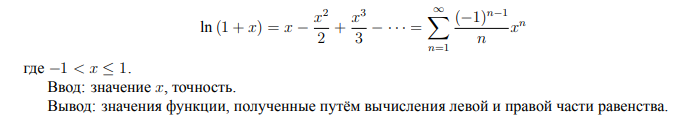

# Лабораторная работа № 4 «Обработка вещественных чисел»

## Введение

Необходимо спроектировать и разработать на языке Ассемблера программу, осуществляющую
вычисление значения функции в точке при помощи разложения в ряд с использованием чисел с плавающей точкой одинарной или двойной точности.

## Примечания

1. Программа должна использовать функции из библиотеки libc и, в случае необходимости,
libm.
2. Прямое использование программой системных вызовов запрещено.
3. Для ввода/вывода необходимо использовать функции стандартной библиотеки языка C с корректными спецификаторами формата: %d — для целых чисел; %f — для чисел с плавающей
точкой одинарной точности; %lf — для чисел с плавающей точкой двойной точности.
4. Программа должна считывать входные данные из стандартного потока ввода, итоговые результаты вычислений помещать в стандартный поток вывода, а результаты вычислений членов ряда, с указанием их номеров, записывать в текстовый файл.
5. Имена файлов должны передаваться программе через параметры командной строки.
6. Программа должна соблюдать соглашение о вызове (calling convention) для всех подпрограмм,
в т. ч. и для внутренних.
7. Программа должна обеспечить корректную обработку ошибок, обеспечив вывод соответствующих сообщений и корректное завершение работы.

## Задание

Вычислить значение функции в точке при помощи разложения в ряд:

## Тип данных, используемый для работы с вещественными числами

Число с плавающей точкой двойной точности.

